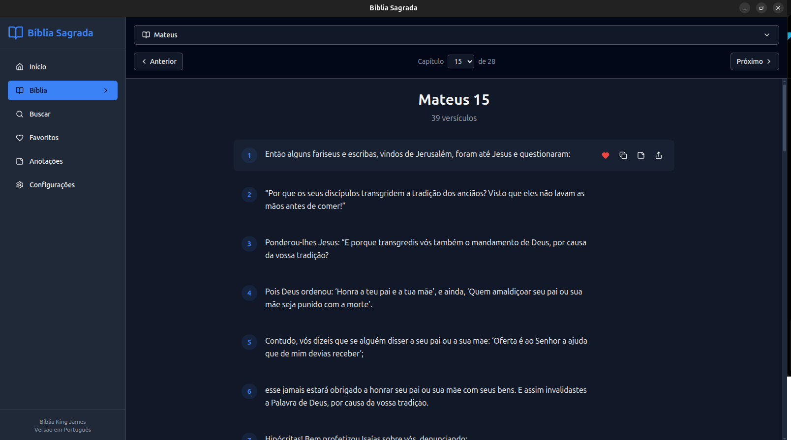

# Bíblia Sagrada - Aplicativo Desktop

Um aplicativo completo da Bíblia Sagrada King James em Português, desenvolvido em Electron + React + TypeScript + SQLite3, com interface moderna e recursos avançados de estudo.



## 🚀 Funcionalidades

### 📖 Leitura
- **Navegação Intuitiva**: Navegue facilmente por livros, capítulos e versículos
- **Interface Moderna**: Design responsivo e limpo inspirado no Material Design
- **Temas**: Modo claro, escuro ou automático baseado no sistema
- **Tipografia Configurável**: Ajuste tamanho e família da fonte conforme sua preferência

### 🔍 Busca Avançada
- **Busca Full-Text**: Encontre versículos por palavras ou frases
- **Filtros Inteligentes**: Busque por livro específico ou testamento
- **Busca Exata**: Opção para busca literal ou por palavras-chave
- **Resultados Destacados**: Termos de busca destacados nos resultados

### ❤️ Favoritos
- **Marcar Versículos**: Salve seus versículos favoritos com um clique
- **Organização**: Ordene por data, livro ou relevância
- **Exportação**: Exporte sua lista de favoritos
- **Acesso Rápido**: Veja seus favoritos na tela inicial

### 📝 Anotações Pessoais
- **Editor Rico**: Crie anotações detalhadas para qualquer versículo
- **Organização**: Gerencie suas anotações por título, data ou livro
- **Busca**: Encontre rapidamente suas reflexões pessoais
- **Backup**: Suas anotações são salvas localmente e podem ser exportadas

### 📊 Recursos Extras
- **Versículo do Dia**: Um versículo diferente apresentado diariamente
- **Histórico de Leitura**: Acompanhe seus últimos capítulos visitados
- **Estatísticas**: Veja suas métricas de uso e progresso
- **Modo Offline**: Funciona completamente sem internet

## 🛠️ Tecnologias

- **Frontend**: React 19 + TypeScript
- **Desktop**: Electron 37
- **Database**: SQLite3 com índices Full-Text Search
- **Styling**: Tailwind CSS + shadcn/ui
- **Icons**: Lucide React
- **Build**: Vite + Electron Forge

## 📋 Pré-requisitos

- Node.js 18+ 
- npm ou yarn
- Git

### Para Ubuntu/Debian:
```bash
sudo apt update
sudo apt install nodejs npm git build-essential libnss3-dev libatk-bridge2.0-dev libxkbcommon-dev libxcomposite-dev libxdamage-dev libxrandr-dev libgbm-dev libxss-dev libasound2-dev
```

## 🚀 Instalação e Execução

### 1. Clone o repositório
```bash
git clone https://github.com/bibliasagrada/app.git
cd app
```

### 2. Instale as dependências
```bash
npm install
```

### 3. Execute em modo de desenvolvimento
```bash
npm run dev
```

### 4. Construa o aplicativo
```bash
npm run build
```

### 5. Gere o pacote .deb para Ubuntu
```bash
npm run make:deb
```

O arquivo `.deb` será criado na pasta `out/`.

## 📦 Empacotamento

### Para Linux (Ubuntu/Debian):
```bash
npm run make:deb
```

### Para todas as plataformas Linux:
```bash
npm run make:linux
```

### Para Windows:
```bash
npm run make:win
```

## 🔧 Desenvolvimento

### Estrutura do Projeto
```
biblia/
├── src/
│   ├── components/          # Componentes React reutilizáveis
│   │   └── ui/             # Componentes de interface base
│   ├── pages/              # Páginas principais da aplicação
│   ├── hooks/              # React hooks personalizados
│   ├── database/           # Camada de banco de dados
│   ├── types/              # Definições TypeScript
│   ├── utils/              # Utilitários e helpers
│   ├── main.ts             # Processo principal do Electron
│   ├── preload.ts          # Script de preload seguro
│   └── renderer.tsx        # Aplicação React principal
├── assets/                 # Recursos estáticos
├── forge.config.ts         # Configuração do Electron Forge
└── package.json
```

### Scripts Disponíveis

| Script | Descrição |
|--------|-----------|
| `npm run dev` | Inicia em modo desenvolvimento |
| `npm run build` | Constrói o aplicativo |
| `npm run make:deb` | Gera pacote .deb |
| `npm run make:rpm` | Gera pacote .rpm |
| `npm run lint` | Executa linting |
| `npm run type-check` | Verifica tipos TypeScript |

## 🎨 Personalização

### Temas
O aplicativo suporta três modos de tema:
- **Claro**: Interface clara para leitura diurna
- **Escuro**: Interface escura para leitura noturna
- **Sistema**: Segue automaticamente o tema do sistema operacional

### Tipografia
Configure a experiência de leitura:
- **Tamanhos**: Pequena, Média, Grande, Extra Grande
- **Famílias**: Sistema, Serif, Sans Serif, Monoespaçada

## 🗄️ Banco de Dados

O aplicativo usa SQLite3 com as seguintes tabelas:

- `livros` - Informações dos livros bíblicos
- `versiculos` - Texto completo dos versículos com índice FTS
- `favoritos` - Versículos marcados pelo usuário
- `anotacoes` - Anotações pessoais dos usuários
- `historico_leitura` - Histórico de navegação
- `configuracoes` - Preferências do usuário

## 🔒 Segurança

- **Context Isolation**: Habilitado para máxima segurança
- **Node Integration**: Desabilitado no renderer
- **Content Security Policy**: Configurado restritivamente
- **Preload Seguro**: API limitada e validada

## 🤝 Contribuição

1. Faça um fork do projeto
2. Crie sua branch de feature (`git checkout -b feature/AmazingFeature`)
3. Commit suas mudanças (`git commit -m 'Add some AmazingFeature'`)
4. Push para a branch (`git push origin feature/AmazingFeature`)
5. Abra um Pull Request

### Diretrizes de Desenvolvimento

- Use TypeScript para type safety
- Siga os padrões ESLint configurados
- Escreva commits descritivos
- Teste em múltiplas plataformas
- Mantenha a documentação atualizada

## 📜 Licença

Este projeto está licenciado sob a Licença MIT - veja o arquivo [LICENSE](LICENSE) para detalhes.

## 🙏 Agradecimentos

- **King James Bible**: Tradução utilizada
- **Electron Team**: Framework desktop
- **React Team**: Biblioteca de interface
- **Tailwind CSS**: Framework de estilização
- **shadcn/ui**: Componentes de interface
- **Lucide**: Conjunto de ícones

## 📞 Suporte

- **Issues**: [GitHub Issues](https://github.com/bibliasagrada/app/issues)
- **Discussões**: [GitHub Discussions](https://github.com/bibliasagrada/app/discussions)
- **Email**: contato@bibliasagrada.com

## 🔄 Versões

### v1.0.0 (Atual)
- ✅ Leitura completa da Bíblia
- ✅ Sistema de favoritos
- ✅ Anotações pessoais
- ✅ Busca avançada
- ✅ Temas claro/escuro
- ✅ Versículo do dia
- ✅ Histórico de leitura
- ✅ Empacotamento .deb

### Próximas Versões
- 🔄 Planos de leitura
- 🔄 Comentários bíblicos
- 🔄 Mapas bíblicos
- 🔄 Sincronização na nuvem
- 🔄 Múltiplas traduções
- 🔄 Modo de apresentação

## 📊 Status do Projeto


---

**Desenvolvido com ❤️ para a comunidade cristã**